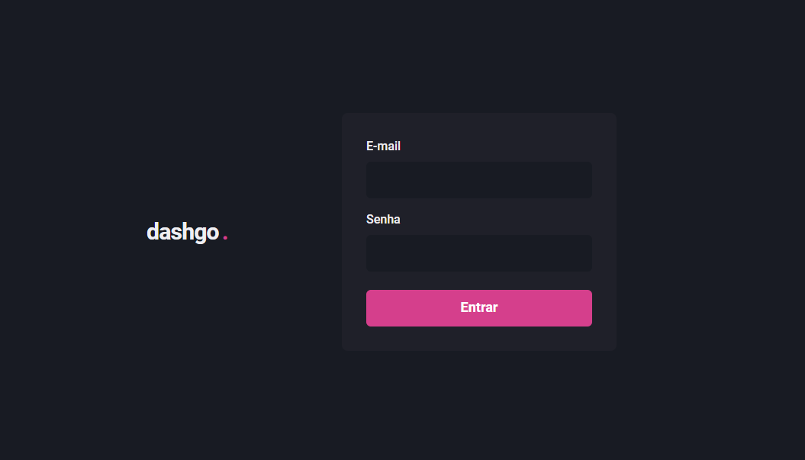

<p align="center">
  
</p>

## 🎉 Let's go!

Para iniciar o projeto insira o comando:
```
npm run dev
```
ou entre no link:
```

```


## 💻 Projeto

Uma aplicação desenvolvida em Next.js que permite o login de usuário, um painel administrativo com Dashboards e a possibilidade de criar novos usuários.


## 🚀 Tecnologias

Esse projeto foi desenvolvido com as seguintes tecnologias:

- HTML e CSS
- Typescript
- React
- Node e NPM
- Next.js


## 📚 Bibliotecas

- React Icons
- Chakra UI